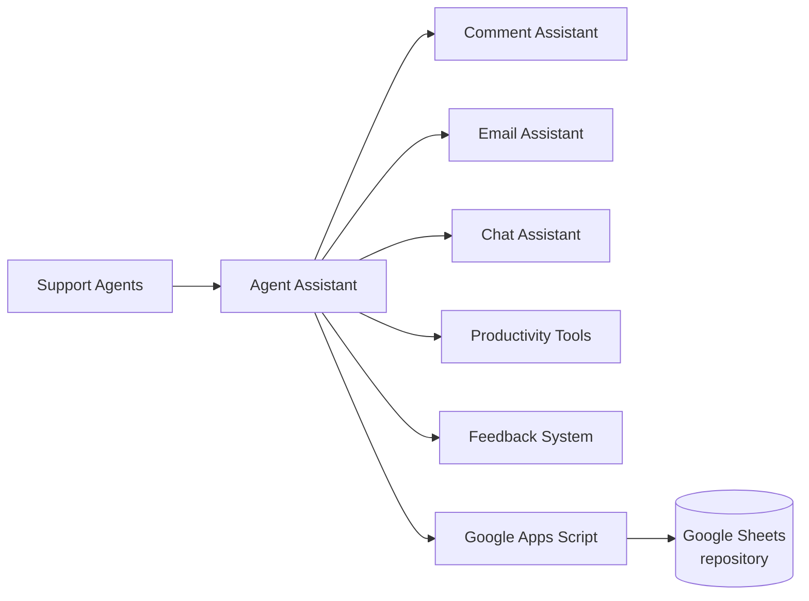

# 🤖 Agent Assistant

  
  
  
  
  

> A workforce support assistant for support agents — **interaction logging,
> email generation, chat responses, and daily productivity tools** in one
> Google Workspace-native interface. Fewer repetitive tasks, better
> documentation, faster workflows.

## 🧩 The Problem

Support agents juggle documentation, emails, and chat replies across separate
tools every interaction. That means repetitive typing, inconsistent
documentation, slower handle times, and knowledge scattered everywhere.

## ✅ The Solution

Agent Assistant combines the daily toolset into one interface — log the
interaction, draft the email, grab the chat response, run the timers —
with a lightweight Google Sheets backend doing all the heavy lifting.

## ✨ Key Features

| Module | What it does |
|---|---|
| 📝 **Comment Assistant** | Structured interaction logging · driver tier classification · resolution reasons · workflow tracking · ride-link docs · one-click clipboard export |
| 📧 **Email Assistant** | Rich-text editor · dynamic templates · driver/customer modes · smart canned responses · personalized greetings & closures |
| 💬 **Chat Assistant** | Slash-command snippets · search-as-you-type · shared response repository · full create/edit/delete template management |
| 🛠 **Productivity Tools** | Call & break timers · timezone lookup by area code · quick-copy templates · notifications |

## 🖼 Screenshots

**Comment Assistant** — logging, tracking & clipboard-ready documentation:

**Email Assistant** — templated rich-text email generation:

**Chat Assistant** — slash-command responses with a searchable knowledge base:

## 🏗 Architecture

## 💼 Business Impact

- Reduced repetitive manual work
- Standardized documentation and communication
- Accelerated email generation
- Improved response consistency
- Centralized operational tools → higher daily productivity

## 🛠 Technology

Google Apps Script · JavaScript · HTML5 · CSS3 · Google Sheets · Quill Editor · Ionicons

## ✨ Project Highlights

- Built and maintained by a single developer
- 100+ weekly active users
- Zero infrastructure — fully on Google Workspace
- Continuously enhanced through user feedback

## 🔮 Future Enhancements

Advanced analytics dashboard · expanded workflow automation · additional
reporting tools · template categories & tagging · usage statistics ·
enhanced knowledge base · mobile experience improvements

## 📜 Version History

| Version | Highlights |
|---|---|
| **v1.0** | Initial release — Comment, Email & Chat assistants plus productivity toolset on a Google Sheets backend |

## 📄 Disclaimer

This repository showcases the application's architecture, functionality, and
design for portfolio purposes. Company-specific configurations, proprietary
business logic, customer information, operational procedures, and sensitive
internal data have been intentionally excluded.

---

<b>🤖 Agent Assistant</b> <i>Every interaction tool. One interface.</i>

